# IckyCrystals Portal - Your Spiritual Business Companion

TravelAI is a Next.js application that uses the Mastra AI agent framework to help you plan your next trip.

## Features

- Travel date and location selection
- Trip goals specification
- Flight and accommodation preferences
- Attraction preferences based on interests
- AI-generated travel itineraries

## Tech Stack

- **Next.js**: React framework for server-rendered applications
- **TypeScript**: Type-safe JavaScript
- **Tailwind CSS**: Utility-first CSS framework
- **Mastra**: AI agent framework for building assistants
- **Vercel AI SDK**: SDK for working with various LLM providers

## Getting Started

### Prerequisites

- Node.js (v18 or later)
- npm or yarn
- OpenAI API key (or other LLM provider key)

### Installation

1. Clone the repository:

```bash
git clone https://github.com/IckyCrystals/Portals.git
cd travel-ai
```

2. Install dependencies:

```bash
npm install
# or
yarn install
```

3. Create a `.env.local` file in the root directory and add your API keys:

```
OPENAI_API_KEY=your-openai-api-key
# Optional: Other LLM provider keys
# ANTHROPIC_API_KEY=your-anthropic-api-key
# GOOGLE_GENERATIVE_AI_API_KEY=your-gemini-api-key
```

4. Start the development server:

```bash
npm run dev
# or
yarn dev
```

5. Open [http://localhost:3000](http://localhost:3000) in your browser.

## Deployment

This application can be easily deployed to Vercel:

```bash
npm run build
npm run start
# or deploy directly to Vercel
vercel
```

## License

[MIT](LICENSE)

## Acknowledgements

- Mastra for the AI agent framework
- Vercel for the AI SDK
- Next.js team for the awesome framework 

# Crystal Portal Soul Staff Blueprint System

Welcome to your spiritual retail management companion—a system designed to harmonize your business operations with the deeper purpose of your crystal shop or spiritual boutique.

## What This System Does For You

As a spiritual business owner, you understand that running a crystal shop or metaphysical store requires more than just managing inventory and sales. Your business is about creating meaningful connections, maintaining sacred space, and supporting both your staff's and customers' spiritual journeys.

This system helps you:
- 🔮 Create detailed soul blueprints for each team member
- 💫 Generate personalized development paths
- 🌟 Maintain your store's energetic harmony
- 🎯 Track both spiritual and business growth
- 💝 Enhance customer connections

## System Components

### 1. Soul Blueprint Form


Your window into understanding each team member's unique essence:
- Personal & astrological information
- Human Design profile
- Crystal affinities
- Work style preferences
- Spiritual & career goals

### 2. AI-Powered Analysis (Mastra Agentic System)
Our spiritual AI assistant helps you:
- Analyze employee data holistically
- Generate personalized insights
- Create development recommendations
- Schedule meaningful check-ins
- Maintain team harmony

### 3. Secure Data Storage (Supabase)
Safely stores your sensitive information:
- Employee spiritual profiles
- Development tracking
- Crystal assignments
- Team dynamics
- Business metrics

## Getting Started

### 1. Initial Setup
```bash
# Clone the repository
git clone https://github.com/IckyCrystals/Portals.git

# Install dependencies
npm install

# Set up your environment
cp .env.example .env.local
```

### 2. Configure Your Space
Add your spiritual business details in `.env.local`:
```env
NEXT_PUBLIC_STORE_NAME="Your Crystal Shop Name"
NEXT_PUBLIC_SUPABASE_URL=your_db_url
NEXT_PUBLIC_SUPABASE_ANON_KEY=your_key
OPENAI_API_KEY=your_key
```

### 3. Launch Your Portal
```bash
npm run dev
```
Visit [http://localhost:3000](http://localhost:3000) to begin your journey.

## Key Features

### For You (The Owner)
- 📊 Dashboard with spiritual & business insights
- 🎯 Team harmony monitoring
- 💫 Growth opportunity identification
- 🔮 Crystal energy tracking
- 📅 Automated scheduling of spiritual check-ins

### For Your Staff
- 🌟 Personal development tracking
- 💎 Crystal affinity matching
- 🤝 Team dynamics insights
- 📚 Product knowledge development
- 🎯 Goal alignment tools

### For Your Business
- 🏪 Sacred space management
- 📈 Energy flow optimization
- 💝 Customer connection enhancement
- 📊 Spiritual retail metrics
- 🌱 Growth tracking

## System Architecture


## Directory Structure

```
crystal-portal/
├── app/                    # Your main application
│   ├── components/         # UI components
│   └── README.md          # Form documentation
├── mastra-agentic/        # Your AI assistant
│   ├── agents/            # Specialized helpers
│   └── README.md          # AI system docs
└── README.md              # This guide
```

## Support & Resources

### Documentation
- [Soul Blueprint Form Guide](./app/README.md)
- [AI System Documentation](./mastra-agentic/README.md)
- [API Reference](https://docs.ickycrystals.com/api)

### Community
Join our community of spiritual business owners:
- [Discord Community](https://discord.gg/ickycrystals)
- [Monthly Webinars](https://ickycrystals.com/webinars)
- [Owner's Circle](https://ickycrystals.com/circle)

### Support
We're here to help you succeed:
- Email: support@ickycrystals.com
- Phone: 1-888-CRYSTAL
- [Book a Consultation](https://ickycrystals.com/consult)

## Contributing

We welcome contributions that enhance the spiritual and practical aspects of our system. See our [Contributing Guide](CONTRIBUTING.md) for details.

## License

This project is licensed under the Crystal Portal License - see the [LICENSE](LICENSE) file for details.

---

💫 Ready to transform your spiritual business? [Get Started Now](https://ickycrystals.com/start)

## Data Flow Examples

### 1. New Staff Onboarding Flow


### 2. Crystal Alignment Process


### 3. Real-World Example: Staff Development

```typescript
// Example of data flow through system
interface StaffJourney {
  // Initial Data Collection
  initialBlueprint: {
    personal: PersonalInfo;
    crystals: CrystalPreferences[];
    goals: DevelopmentGoals;
  };

  // AI Processing
  analysis: {
    strengths: string[];
    opportunities: string[];
    recommendations: Action[];
  };

  // Ongoing Development
  development: {
    trainings: TrainingProgress[];
    achievements: Milestone[];
    feedback: FeedbackLoop[];
  };
}

// Example Implementation
async function processStaffJourney(staffId: string) {
  // 1. Collect Initial Data
  const blueprint = await collectBlueprintData(staffId);
  
  // 2. AI Analysis
  const analysis = await analyzeStaffPotential(blueprint);
  
  // 3. Generate Development Plan
  const developmentPlan = await createDevelopmentPlan(analysis);
  
  // 4. Implementation & Monitoring
  const progress = await trackDevelopment(staffId, developmentPlan);
  
  // 5. Continuous Improvement
  const updates = await updateRecommendations(progress);
  
  return {
    blueprint,
    analysis,
    developmentPlan,
    progress,
    updates
  };
}
```

### 4. System Integration Flow

```mermaid
graph TB
    subgraph "Frontend Layer"
        A1[Blueprint Form]
        A2[Dashboard]
        A3[Reports]
    end
    
    subgraph "API Layer"
        B1[Data Validation]
        B2[Auth & Security]
        B3[Rate Limiting]
    end
    
    subgraph "Processing Layer"
        C1[Mastra AI Agents]
        C2[Analysis Engine]
        C3[Action Generator]
    end
    
    subgraph "Storage Layer"
        D1[Supabase Tables]
        D2[Document Store]
        D3[Cache Layer]
    end
    
    A1 & A2 & A3 --> B1 & B2 & B3
    B1 & B2 & B3 --> C1 & C2 & C3
    C1 & C2 & C3 --> D1 & D2 & D3
    D1 & D2 & D3 --> A2 & A3
```


### 5. Data Transformation Example
```typescript
// Example of data transformation through system layers
interface RawStaffData {
  name: string;
  birthDate: string;
  crystalPreferences: string[];
}

interface ProcessedStaffData {
  id: string;
  personal: {
    name: string;
    birthChart: AstrologicalChart;
    energyProfile: EnergySignature;
  };
  crystals: {
    preferences: CrystalAlignment[];
    recommendations: CrystalMatch[];
  };
}

interface BusinessInsight {
  staffMember: ProcessedStaffData;
  recommendations: Action[];
  timeline: Timeline;
  metrics: PerformanceMetrics;
}

// Example transformation flow
const transformationPipeline = async (rawData: RawStaffData): Promise<BusinessInsight> => {
  // 1. Data Validation & Enrichment
  const validatedData = await validateStaffData(rawData);
  
  // 2. Astrological Processing
  const astroData = await processAstrologicalData(validatedData);
  
  // 3. Crystal Matching
  const crystalMatches = await performCrystalMatching(astroData);
  
  // 4. Business Intelligence
  const insights = await generateBusinessInsights({
    staff: astroData,
    crystals: crystalMatches
  });
  
  return insights;
};
``` 