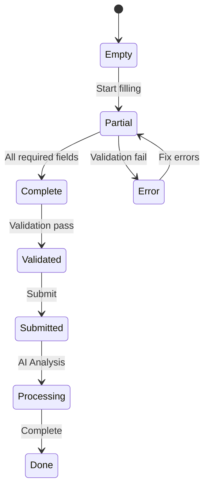
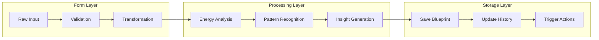
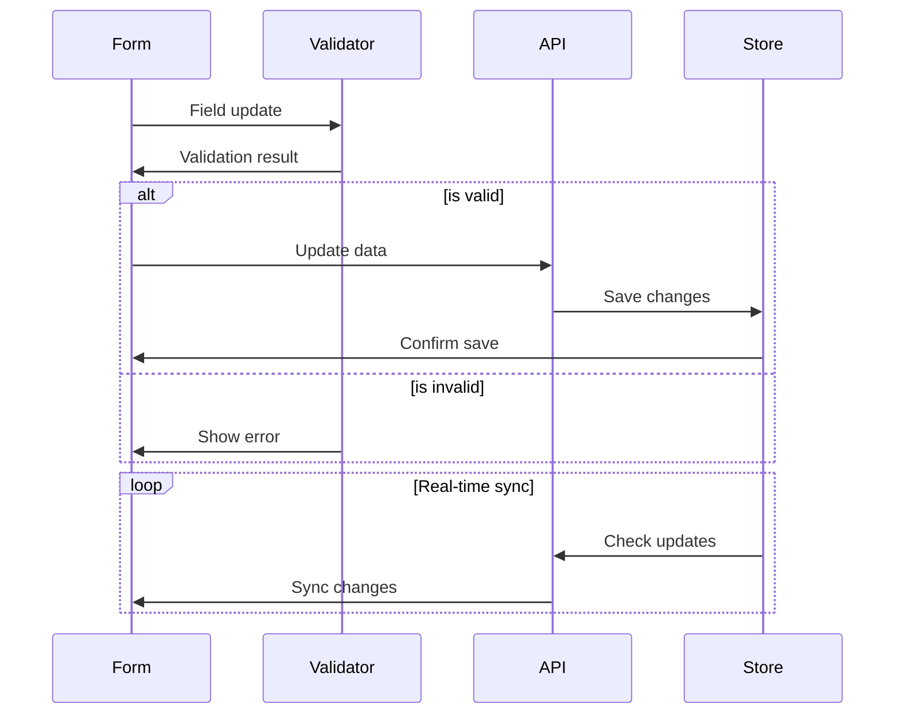

# IckyCrystals Portal - Soul Staff Blueprint Form

Your intuitive interface for collecting comprehensive staff information in your spiritual retail business.


## Form Sections

### 1. Personal Information
```typescript
interface PersonalInfo {
  fullName: string;
  birthday: Date;
  birthTime?: string;  // Optional
  birthLocation: string;
}
```
- Full name entry
- Birthday selection with calendar
- Optional birth time input
- Birth location (City, Country)

### 2. Human Design
```typescript
interface HumanDesign {
  type: 'Generator' | 'Manifestor' | 'Projector' | 'Reflector' | 'Manifesting Generator';
  profile: string;
  authority: string;
}
```
- Human Design Type dropdown
- Profile information selection
- Authority type options
- Helps understand natural decision-making patterns

### 3. Crystal Preferences
```typescript
interface CrystalPreferences {
  favoriteCrystals: string[];  // Top 3
  meanings: {
    crystal: string;
    personalMeaning: string;
  }[];
}
```
- Input fields for top 3 favorite crystals
- Personal meaning and connection descriptions
- Crystal work experience details

### 4. Work Style
```typescript
interface WorkStyle {
  salesStyle: string;
  communicationStyle: string;
  favoriteProducts: string[];  // Top 3
}
```
- Sales style preference selection
- Communication style options
- Favorite products to recommend
- Customer interaction preferences

### 5. Personal Goals & Preferences
```typescript
interface PersonalGoals {
  career: string;
  spiritual: string;
  financial: string;
}
```
- Career aspirations text area
- Spiritual intentions input
- Financial goals section

## Usage

```typescript
import { SoulBlueprintForm } from '../components/BlueprintForm';

export default function YourPage() {
  const handleSubmit = async (data: BlueprintFormData) => {
    // Handle form submission
    const response = await submitBlueprint(data);
    // Process response
  };

  return (
    <SoulBlueprintForm 
      onSubmit={handleSubmit}
      theme="crystal"
      initialData={existingData}  // Optional
    />
  );
}
```

## Features

- 💫 Intuitive, section-based layout
- 🎨 Crystal-themed styling
- ✨ Real-time validation
- 📱 Responsive design
- 🔒 Secure data handling
- 🌈 Accessibility support

## Form Validation

```typescript
const validationRules = {
  personal: {
    fullName: { required: true },
    birthday: { required: true },
    birthLocation: { required: true }
  },
  humanDesign: {
    type: { required: false },
    profile: { required: false },
    authority: { required: false }
  },
  crystals: {
    favoriteCrystals: { minLength: 1, maxLength: 3 }
  },
  workStyle: {
    salesStyle: { required: true },
    communicationStyle: { required: true }
  },
  goals: {
    career: { required: true },
    spiritual: { required: true }
  }
};
```

## API Integration

The form connects with the Crystal Portal Soul Staff Blueprint System through:

```typescript
async function submitBlueprint(data: BlueprintFormData) {
  const response = await fetch('/api/blueprint', {
    method: 'POST',
    headers: {
      'Content-Type': 'application/json',
    },
    body: JSON.stringify(data),
  });
  return response.json();
}
```

## Styling

The form uses Tailwind CSS with custom theme extensions:

```javascript
// tailwind.config.js
module.exports = {
  theme: {
    extend: {
      colors: {
        crystal: {
          purple: '#9F7AEA',
          pink: '#FED7E2',
          yellow: '#FEFCBF',
          teal: '#81E6D9'
        }
      }
    }
  }
};
```

## Testing

Run the test suite:

```bash
npm run test:form
```

Visit the test page at [http://localhost:3000/test](http://localhost:3000/test)

## Contributing

To contribute to the form component:

1. Follow the design guidelines
2. Maintain accessibility standards
3. Add tests for new features
4. Update documentation
5. Submit a pull request

## Support

For form-specific issues or questions:
- GitHub Issues: [Form Component Issues](https://github.com/IckyCrystals/Portals/issues)
- Documentation: [Form Component Docs](https://docs.ickycrystals.com/form)
- Email: support@ickycrystals.com

## Data Flow & Form Processing

### 1. Form State Management


### 2. Form Data Processing Pipeline


### 3. Form Validation Example
```typescript
interface FormValidation {
  // Field validation rules
  rules: {
    personal: {
      name: RegExp;
      birthday: DateValidator;
      location: LocationValidator;
    };
    humanDesign: {
      type: string[];
      profile: string[];
      authority: string[];
    };
    crystals: {
      preferences: {
        min: number;
        max: number;
        required: boolean;
      };
    };
  };

  // Validation methods
  methods: {
    validateField: (field: string, value: any) => ValidationResult;
    validateSection: (section: string) => SectionValidation;
    validateForm: () => FormValidation;
  };

  // Error handling
  errors: {
    field: FieldError[];
    section: SectionError[];
    form: FormError[];
  };
}

// Example validation implementation
const validateBlueprintForm = async (data: BlueprintFormData): Promise<ValidationResult> => {
  // 1. Basic field validation
  const fieldValidation = validateFields(data);
  if (!fieldValidation.isValid) return fieldValidation;

  // 2. Cross-field validation
  const crossFieldValidation = validateFieldRelationships(data);
  if (!crossFieldValidation.isValid) return crossFieldValidation;

  // 3. Spiritual alignment validation
  const spiritualValidation = await validateSpiritualAlignment(data);
  if (!spiritualValidation.isValid) return spiritualValidation;

  // 4. Business rules validation
  const businessValidation = validateBusinessRules(data);
  if (!businessValidation.isValid) return businessValidation;

  return { isValid: true, data: processedData };
};
```

### 4. Real-time Updates Flow


### 5. Form to Database Pipeline
```typescript
// Example of form data transformation pipeline
interface FormToDatabasePipeline {
  // 1. Form data collection
  collectFormData: () => Promise<RawFormData>;

  // 2. Data validation
  validateData: (data: RawFormData) => Promise<ValidatedData>;

  // 3. Data enrichment
  enrichData: (data: ValidatedData) => Promise<EnrichedData>;

  // 4. Database preparation
  prepareForDatabase: (data: EnrichedData) => Promise<DatabaseRecord>;

  // 5. Storage and indexing
  storeAndIndex: (record: DatabaseRecord) => Promise<StorageResult>;
}

// Implementation example
const processBlueprintSubmission = async (formData: RawFormData): Promise<SubmissionResult> => {
  try {
    // 1. Initial validation
    const validatedData = await validateFormData(formData);

    // 2. Enrich with additional data
    const enrichedData = await enrichWithSpiritualData(validatedData);

    // 3. Process through AI
    const aiProcessedData = await processWithAI(enrichedData);

    // 4. Prepare for storage
    const databaseRecord = prepareDatabaseRecord(aiProcessedData);

    // 5. Store in database
    const storageResult = await storeInDatabase(databaseRecord);

    // 6. Generate initial insights
    const insights = await generateInitialInsights(storageResult);

    return {
      success: true,
      data: storageResult,
      insights,
      nextSteps: generateNextSteps(insights)
    };
  } catch (error) {
    handleSubmissionError(error);
    return {
      success: false,
      error: formatError(error)
    };
  }
};
``` 