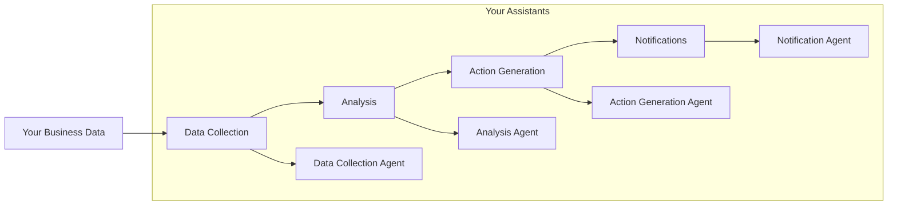
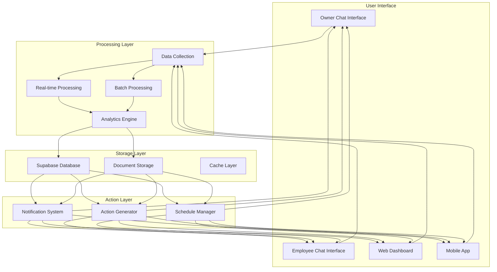
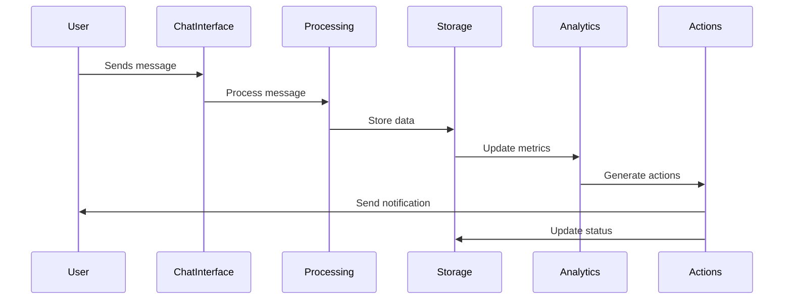
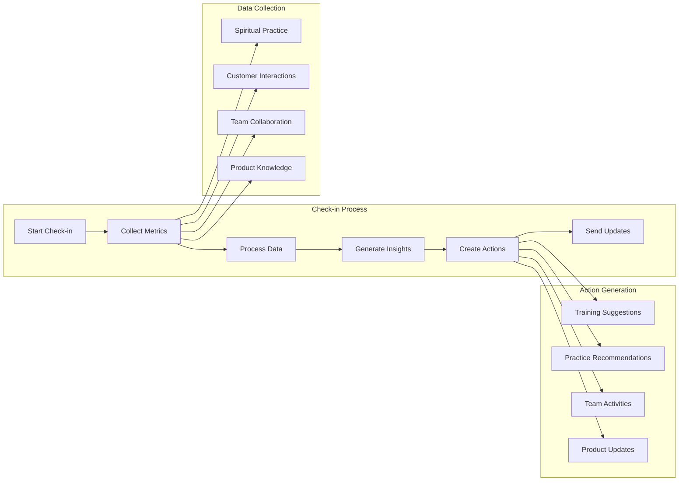
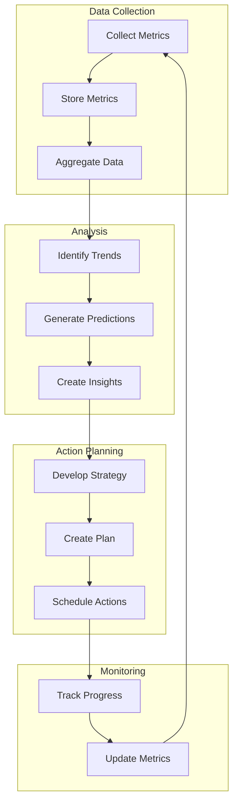
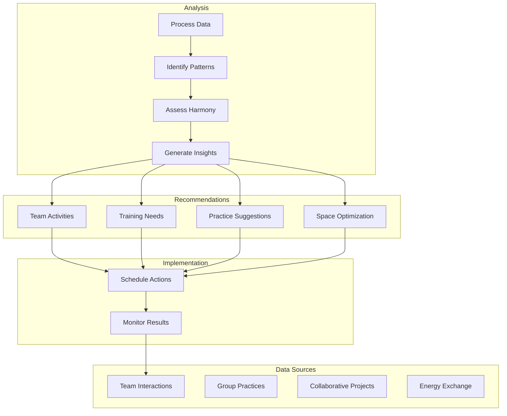
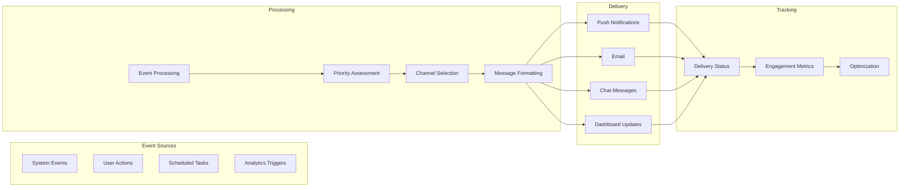
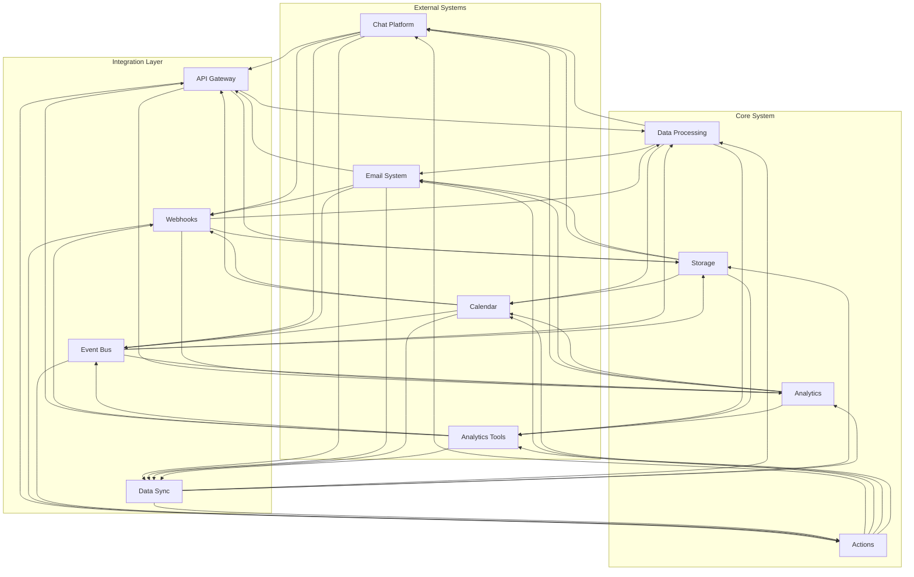

# Crystal Soul Staff Agentic System

The Crystal Soul Staff Agentic System is your personal AI assistant for managing your spiritual retail business. It helps you maintain the energetic integrity of your store while ensuring smooth operations, acting as a "SoulFlow" manager that supports both you and your staff in creating a harmonious, spiritually-aligned retail environment.

## About

As a store owner, you understand that running a spiritual business requires balancing practical operations with maintaining sacred space. This system is designed to be your trusted assistant, helping you manage the unique challenges of spiritual retail while preserving the essence of your vision.

### Your Personal Support System
- **Business Intuition**: Aligns with your spiritual business vision
- **Energetic Management**: Helps maintain the store's spiritual atmosphere
- **Staff Harmony**: Supports your team's spiritual and professional growth
- **Customer Experience**: Ensures authentic spiritual connections with customers

### Key Benefits for You
1. **Spiritual Business Management**
   - Maintains energetic integrity of your store
   - Aligns staff with your spiritual vision
   - Tracks crystal and product energetics
   - Monitors customer spiritual experiences

2. **Operational Support**
   - Manages daily store operations
   - Tracks inventory and product knowledge
   - Handles staff scheduling and training
   - Maintains business policies and procedures

3. **Growth and Expansion**
   - Identifies business growth opportunities
   - Suggests staff development paths
   - Tracks business and spiritual metrics
   - Supports your vision for expansion

### Perfect For Your Business
- Your crystal shop or metaphysical store
- Spiritual wellness center
- Holistic healing practice
- Yoga studio with retail space
- Any spiritual business where authenticity matters

## System Personality and Role

The system embodies your values and vision, acting as an extension of your leadership while you focus on the bigger picture of your spiritual business.

## Directory Structure

```
crystal-soul-staff/
├── agents/           # Your management assistants
│   ├── dataCollectionAgent.ts    # Tracks business and spiritual data
│   ├── analysisAgent.ts          # Provides business insights
│   ├── actionGenerationAgent.ts  # Suggests improvements
│   ├── notificationAgent.ts      # Keeps you informed
│   └── index.ts
├── tools/           # Your business tools
│   └── supabase.ts  # Your business data hub
├── workflows/       # Your business processes
│   ├── workflow.ts  # Main business flow
│   └── README.md    # Process documentation
└── README.md        # This guide
```

## Workflow Overview

The system follows your business rhythm:



For detailed workflow documentation, see [workflows/README.md](./workflows/README.md)

## Your Business Data Hub

The system uses Supabase to organize your business information:

### Core Business Data
- `employees`: Your team's information
- `employee_blueprints`: Staff spiritual profiles
- `employee_crystals`: Crystal assignments
- `employee_products`: Product knowledge
- `employee_goals`: Team development goals
- `employee_work_style`: Work preferences
- `employee_actions`: Improvement suggestions
- `employee_insights`: Business insights
- `employee_notifications`: Important updates

### Business Documentation
- `sop_documents`: Your store procedures
- `sop_templates`: Standard templates
- `product_knowledge`: Product information
- `customer_experience`: Customer feedback
- `business_metrics`: Performance tracking

## Features That Support You

### Business Management
- Team profile management
- Spiritual alignment tracking
- Product knowledge base
- Goal and progress tracking
- Work style optimization

### Business Insights
- AI-powered business analysis
- Pattern recognition
- Strength identification
- Growth opportunities
- Customer experience insights

### Action Planning
- Personalized recommendations
- Goal-based actions
- Staff development plans
- Product knowledge updates
- Customer service improvements

### Communication
- Multi-channel updates
- Scheduled notifications
- Delivery tracking
- Error handling
- Priority management

### Documentation
- Procedure management
- Version control
- Access management
- Review process
- Resource library

## Business Metrics and Growth Tracking

### Employee Engagement Metrics
1. **Spiritual Alignment Score**
   - Personal spiritual practice consistency
   - Crystal and energy work proficiency
   - Customer spiritual connection success rate
   - Meditation and mindfulness participation

2. **Professional Development**
   - Product knowledge mastery levels
   - Customer service excellence ratings
   - Training completion and effectiveness
   - Skill advancement tracking

3. **Team Harmony Indicators**
   - Interpersonal connection strength
   - Collaborative project success
   - Energy exchange quality
   - Group meditation participation

### Predictive Growth Measures
1. **Business Health Indicators**
   ```typescript
   interface BusinessHealthMetrics {
     spiritual_vibrancy: number;  // Store's energetic health
     customer_connection: number; // Customer engagement quality
     product_alignment: number;   // Product-spiritual match
     staff_harmony: number;       // Team energetic balance
   }
   ```

2. **Growth Opportunity Analysis**
   - New product line potential
   - Service expansion possibilities
   - Staff development pathways
   - Customer experience enhancements

3. **Trend Prediction**
   - Seasonal spiritual needs
   - Customer interest patterns
   - Staff growth trajectories
   - Business expansion timing

### Performance Tracking
1. **Daily Metrics**
   - Customer spiritual connection quality
   - Product knowledge application
   - Energy work effectiveness
   - Team harmony levels

2. **Weekly Analysis**
   - Staff spiritual growth
   - Customer feedback patterns
   - Product performance
   - Energy flow optimization

3. **Monthly Review**
   - Business spiritual alignment
   - Staff development progress
   - Customer experience trends
   - Growth opportunity identification

### Predictive Analytics
1. **Staff Development**
   ```typescript
   interface StaffGrowthPrediction {
     next_skill_level: string;
     recommended_trainings: string[];
     potential_roles: string[];
     spiritual_growth_path: string[];
   }
   ```

2. **Business Expansion**
   - New product line timing
   - Service expansion readiness
   - Staff capacity planning
   - Space utilization optimization

3. **Customer Experience**
   - Interest trend prediction
   - Service need forecasting
   - Product demand anticipation
   - Spiritual guidance requirements

### Implementation Example
```typescript
// Track and predict staff growth
const staffMetrics = {
  spiritual_alignment: 0.85,
  product_knowledge: 0.90,
  customer_connection: 0.88,
  energy_work: 0.82
};

// Predict next development steps
const growthPrediction = await predictStaffGrowth(staffMetrics);
// Returns:
// {
//   next_focus: "Advanced Crystal Healing",
//   timeline: "3-6 months",
//   recommended_trainings: ["Crystal Grids", "Energy Clearing"],
//   potential_roles: ["Lead Crystal Consultant", "Energy Work Specialist"]
// }
```

## Chat-Bot Interface

The system provides an intuitive chat-bot interface that serves as the primary interaction point for both owners and employees, seamlessly connecting with our data infrastructure.

### Owner Interface
```typescript
interface OwnerChatInterface {
  // Business Management
  checkBusinessHealth(): Promise<BusinessHealthMetrics>;
  reviewStaffPerformance(): Promise<StaffMetrics[]>;
  analyzeGrowthOpportunities(): Promise<GrowthPrediction[]>;
  
  // Staff Management
  viewStaffProfiles(): Promise<EmployeeProfile[]>;
  trackStaffDevelopment(): Promise<DevelopmentProgress[]>;
  scheduleTraining(): Promise<TrainingSchedule>;
  
  // Business Insights
  getDailyMetrics(): Promise<DailyMetrics>;
  reviewWeeklyAnalysis(): Promise<WeeklyAnalysis>;
  generateMonthlyReport(): Promise<MonthlyReport>;
}

// Example usage
const ownerBot = new OwnerChatInterface();
await ownerBot.checkBusinessHealth();
// Returns:
// {
//   spiritual_vibrancy: 0.92,
//   customer_connection: 0.88,
//   product_alignment: 0.95,
//   staff_harmony: 0.90
// }
```

### Employee Interface
```typescript
interface EmployeeChatInterface {
  // Personal Development
  checkPersonalMetrics(): Promise<PersonalMetrics>;
  viewTrainingProgress(): Promise<TrainingStatus>;
  requestGuidance(): Promise<SpiritualGuidance>;
  
  // Daily Operations
  logDailyPractices(): Promise<PracticeLog>;
  trackCustomerInteractions(): Promise<InteractionMetrics>;
  updateProductKnowledge(): Promise<KnowledgeStatus>;
  
  // Team Collaboration
  checkTeamHarmony(): Promise<TeamMetrics>;
  scheduleGroupPractices(): Promise<PracticeSchedule>;
  shareInsights(): Promise<InsightLog>;
}

// Example usage
const employeeBot = new EmployeeChatInterface();
await employeeBot.checkPersonalMetrics();
// Returns:
// {
//   spiritual_practice: 0.85,
//   crystal_work: 0.90,
//   customer_connection: 0.88,
//   team_collaboration: 0.92
// }
```

### Data Integration
```typescript
interface ChatBotDataIntegration {
  // Real-time Data Sync
  syncBusinessMetrics(): Promise<void>;
  updateStaffProfiles(): Promise<void>;
  refreshTrainingData(): Promise<void>;
  
  // Predictive Analytics
  predictStaffNeeds(): Promise<StaffPredictions>;
  forecastBusinessTrends(): Promise<BusinessForecast>;
  suggestImprovements(): Promise<ImprovementSuggestions>;
  
  // Notification System
  sendOwnerAlerts(): Promise<void>;
  notifyStaffUpdates(): Promise<void>;
  scheduleReminders(): Promise<void>;
}

// Example implementation
const dataIntegration = new ChatBotDataIntegration();
await dataIntegration.syncBusinessMetrics();
// Automatically updates all connected interfaces
```

### Chat Commands
1. **Owner Commands**
   ```
   /health - Check business health metrics
   /staff - View staff performance
   /growth - Analyze growth opportunities
   /metrics - Get detailed business metrics
   /report - Generate business report
   ```

2. **Employee Commands**
   ```
   /profile - View personal metrics
   /training - Check training progress
   /practice - Log daily practices
   /team - Check team harmony
   /insights - Share new insights
   ```

### Integration Example
```typitten
// Setting up the chat interface
const setupChatInterface = async () => {
  const ownerInterface = new OwnerChatInterface();
  const employeeInterface = new EmployeeChatInterface();
  const dataIntegration = new ChatBotDataIntegration();
  
  // Connect to data infrastructure
  await dataIntegration.syncBusinessMetrics();
  
  // Example owner interaction
  const businessHealth = await ownerInterface.checkBusinessHealth();
  console.log('Business Health:', businessHealth);
  
  // Example employee interaction
  const personalMetrics = await employeeInterface.checkPersonalMetrics();
  console.log('Personal Metrics:', personalMetrics);
};
```

## Data Flow and Integration

### System Architecture Overview


### Real-time Data Flow


### Employee Check-in Flow


### Business Health Analysis Flow


### Team Harmony Assessment Flow


### Notification System Flow


### Data Integration Points


## Getting Started

1. Set up your system:
   ```bash
   npm install @supabase/supabase-js
   ```

2. Configure your environment:
   ```env
   NEXT_PUBLIC_SUPABASE_URL=your_business_db_url
   NEXT_PUBLIC_SUPABASE_ANON_KEY=your_business_key
   SLACK_BOT_TOKEN=your_team_communication_token
   ```

3. Initialize your business data:
   ```sql
   -- Set up your business tables
   ```

4. Start managing your business:
   ```typescript
   import { processBusinessBlueprint } from '@/crystal-soul-staff/workflows/workflow';
   
   // Process your business data
   const result = await processBusinessBlueprint(businessId);
   ```

## Contributing to Your Vision

1. Follow the established structure
2. Maintain type safety
3. Include proper error handling
4. Document all changes
5. Update this guide as needed

## License

[Your Business License Here] 