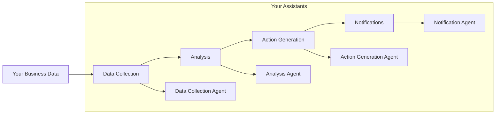

# Crystal Soul Staff Agentic System

The Crystal Soul Staff Agentic System is a sophisticated AI-powered virtual manager framework designed specifically for spiritual retail businesses. It manages employee data, generates insights, and automates personalized actions within the Crystal Portal Soul Staff Blueprint System, acting as a "SoulFlow" virtual manager that supports staff with both practical tasks and spiritual coaching.

## About

The Crystal Soul Staff Agentic System is more than just a management tool—it's a spiritual companion for your retail team. Designed specifically for crystal shops, spiritual boutiques, and metaphysical stores, this system understands the unique needs of spiritual retail environments where both practical business operations and spiritual growth are equally important.

### Core Philosophy
- **Holistic Approach**: Balances business operations with spiritual well-being
- **Personalized Guidance**: Adapts to each staff member's spiritual journey
- **Sacred Space Management**: Helps maintain the energetic integrity of your store
- **Customer Connection**: Enhances staff's ability to provide meaningful spiritual guidance

### Key Differentiators
1. **Spiritual Intelligence**
   - Understands and respects various spiritual practices
   - Integrates astrological and human design insights
   - Supports crystal and energy work knowledge
   - Facilitates intuitive customer service

2. **Practical Support**
   - Manages daily store operations
   - Tracks product knowledge and inventory
   - Handles customer service scenarios
   - Maintains store policies and procedures

3. **Growth Focus**
   - Identifies spiritual development opportunities
   - Suggests relevant training and practices
   - Tracks progress in both practical and spiritual domains
   - Encourages continuous learning and expansion

### Ideal For
- Crystal shops and metaphysical stores
- Spiritual wellness centers
- Holistic healing practices
- Yoga and meditation studios with retail components
- Any business where spiritual knowledge and customer connection are key

## System Personality and Role

The system embodies your values and vision, acting as an extension of your leadership while you focus on the bigger picture of your spiritual business.

## Directory Structure

```
crystal-soul-staff/
├── agents/           # Your management assistants
│   ├── dataCollectionAgent.ts    # Tracks business and spiritual data
│   ├── analysisAgent.ts          # Provides business insights
│   ├── actionGenerationAgent.ts  # Suggests improvements
│   ├── notificationAgent.ts      # Keeps you informed
│   └── index.ts
├── tools/           # Your business tools
│   └── supabase.ts  # Your business data hub
├── workflows/       # Your business processes
│   ├── workflow.ts  # Main business flow
│   └── README.md    # Process documentation
└── README.md        # This guide
```

## Workflow Overview

The system follows your business rhythm:



For detailed workflow documentation, see [workflows/README.md](./workflows/README.md)

## Your Business Data Hub

The system uses Supabase to organize your business information:

### Core Business Data
- `employees`: Your team's information
- `employee_blueprints`: Staff spiritual profiles
- `employee_crystals`: Crystal assignments
- `employee_products`: Product knowledge
- `employee_goals`: Team development goals
- `employee_work_style`: Work preferences
- `employee_actions`: Improvement suggestions
- `employee_insights`: Business insights
- `employee_notifications`: Important updates

### Business Documentation
- `sop_documents`: Your store procedures
- `sop_templates`: Standard templates
- `product_knowledge`: Product information
- `customer_experience`: Customer feedback
- `business_metrics`: Performance tracking

## Features That Support You

### Business Management
- Team profile management
- Spiritual alignment tracking
- Product knowledge base
- Goal and progress tracking
- Work style optimization

### Business Insights
- AI-powered business analysis
- Pattern recognition
- Strength identification
- Growth opportunities
- Customer experience insights

### Action Planning
- Personalized recommendations
- Goal-based actions
- Staff development plans
- Product knowledge updates
- Customer service improvements

### Communication
- Multi-channel updates
- Scheduled notifications
- Delivery tracking
- Error handling
- Priority management

### Documentation
- Procedure management
- Version control
- Access management
- Review process
- Resource library

## Contributing to Your Vision

1. Follow the established structure
2. Maintain type safety
3. Include proper error handling
4. Document all changes
5. Update this guide as needed

## License

This project is licensed under the Crystal Soul Staff License - see the [LICENSE](LICENSE) file for details.

## Support

For technical support or spiritual guidance regarding the system, please contact our support team at support@crystalsoulstaff.com.
