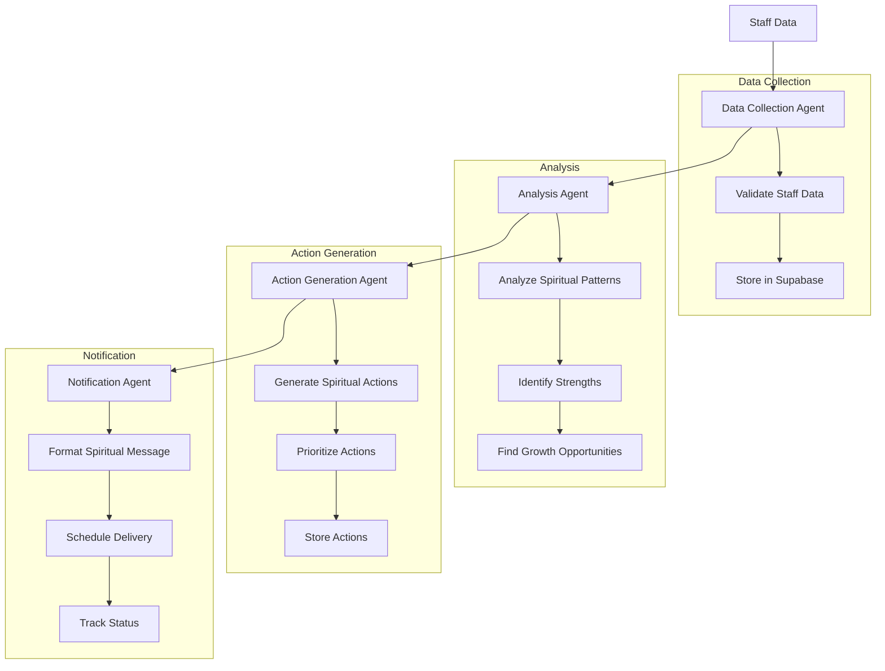
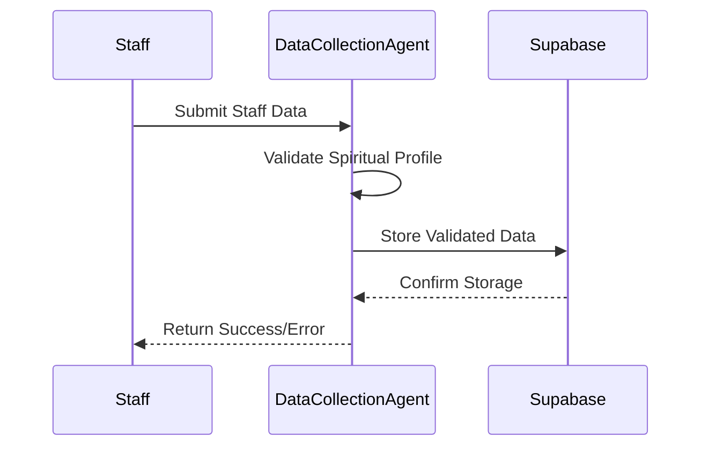
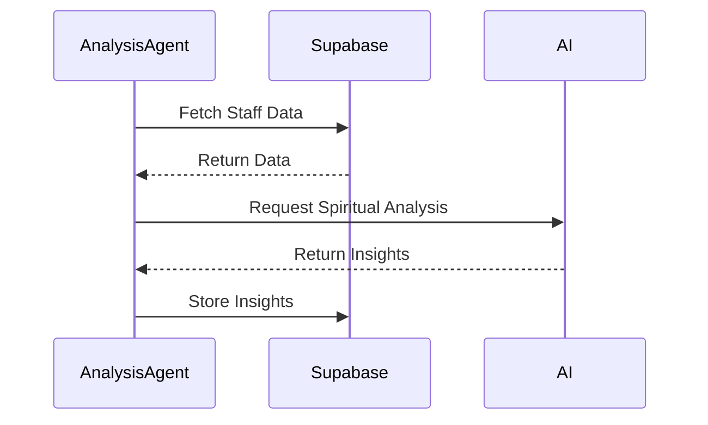
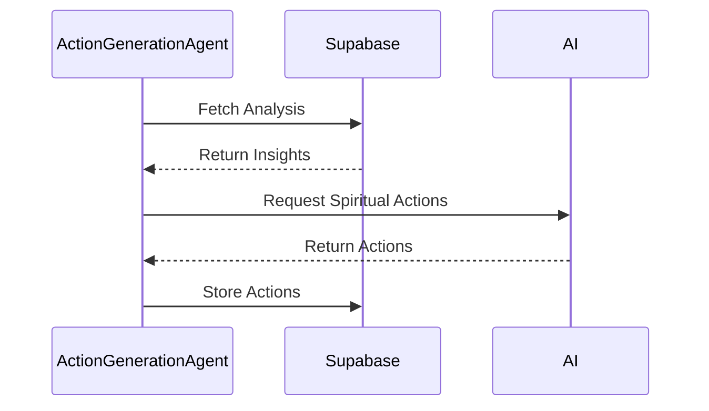
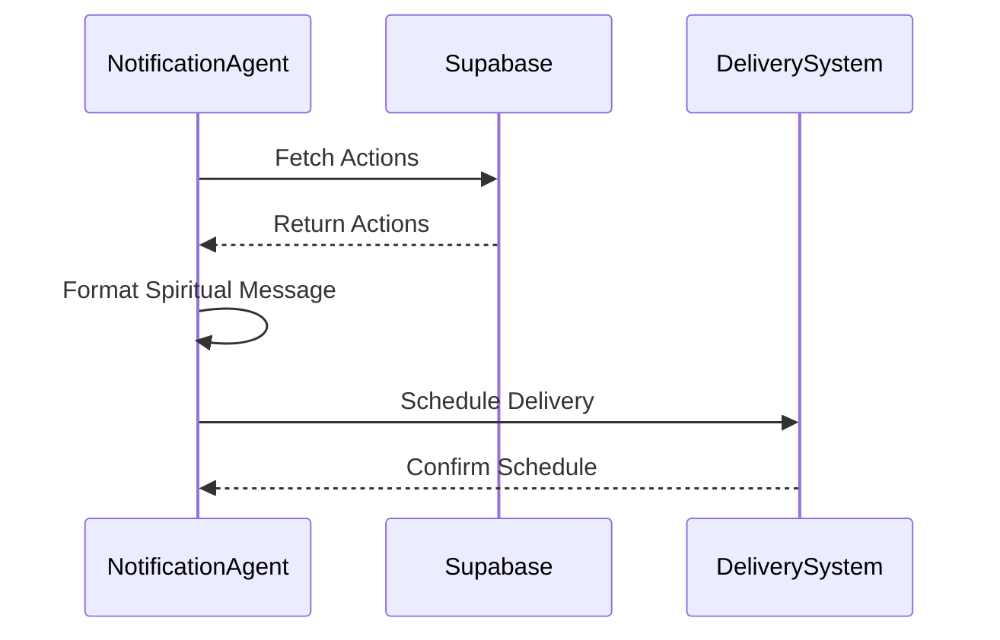

# Crystal Soul Staff Agentic Workflow Documentation

## Workflow Overview

The Crystal Soul Staff Agentic System follows a sophisticated workflow that combines multiple AI agents to process staff data and generate personalized actions in a spiritual retail context. Here's a detailed breakdown of the workflow:



## Detailed Workflow Steps

### 1. Data Collection Phase


### 2. Analysis Phase


### 3. Action Generation Phase


### 4. Notification Phase


## Example Workflow Execution

Here's an example of how the workflow processes a new staff member's data:

1. **Data Collection**:
   ```typescript
   const staffData = {
     name: "John Doe",
     birthday: "1990-05-15",
     human_design_type: "Generator",
     astrological_sign: "Taurus",
     spiritual_practices: ["Meditation", "Crystal Healing"],
     product_knowledge: ["Crystals", "Incense", "Tarot"],
     customer_service_style: "Intuitive"
   };
   
   // Data Collection Agent validates and stores
   await dataCollectionAgent.validateStaffData(staffData);
   ```

2. **Analysis**:
   ```typescript
   // Analysis Agent processes the data
   const analysis = await analysisAgent.analyzeStaffData(staffId);
   // Returns insights like:
   // {
   //   strengths: ["Natural spiritual guidance", "Crystal knowledge"],
   //   opportunities: ["Tarot reading skills", "Customer engagement"],
   //   astrological_insights: ["Strong earth energy", "Practical approach"],
   //   human_design_insights: ["Sacral authority", "Emotional definition"],
   //   spiritual_alignment: ["High", "Meditation practice strong"]
   // }
   ```

3. **Action Generation**:
   ```typescript
   // Action Generation Agent creates personalized actions
   const actions = await actionGenerationAgent.generateActions(staffId, analysis);
   // Returns actions like:
   // {
   //   title: "Advanced Tarot Training",
   //   message: "Based on your spiritual strengths...",
   //   category: "spiritual_development",
   //   priority: "high",
   //   spiritual_focus: "Intuition development"
   // }
   ```

4. **Notification**:
   ```typescript
   // Notification Agent schedules delivery
   await notificationAgent.scheduleNotification(action, {
     channel: "slack",
     scheduled_for: "2024-03-01T09:00:00Z",
     spiritual_tone: "gentle",
     include_meditation: true
   });
   ```

## Error Handling and Recovery

The workflow includes robust error handling at each phase:

1. **Data Validation Errors**:
   - Invalid spiritual profile data
   - Missing required fields
   - Data type mismatches

2. **Analysis Errors**:
   - Insufficient spiritual data
   - AI processing failures
   - Timeout issues

3. **Action Generation Errors**:
   - Invalid analysis input
   - AI generation failures
   - Priority calculation errors

4. **Notification Errors**:
   - Delivery failures
   - Scheduling conflicts
   - Channel unavailability

Each phase includes retry mechanisms and fallback options to ensure workflow completion.

## Monitoring and Logging

The workflow includes comprehensive monitoring:

1. **Performance Metrics**:
   - Processing time per phase
   - Success/failure rates
   - Resource utilization
   - Spiritual alignment tracking

2. **Error Tracking**:
   - Error types and frequencies
   - Recovery success rates
   - System health indicators
   - Spiritual guidance effectiveness

3. **Audit Trail**:
   - Data changes
   - Action history
   - Notification status
   - Spiritual progress tracking

## Best Practices

1. **Data Quality**:
   - Validate spiritual data at entry
   - Maintain data consistency
   - Regular data cleanup
   - Respect spiritual privacy

2. **Performance**:
   - Optimize database queries
   - Cache frequently used data
   - Monitor resource usage
   - Ensure spiritual accuracy

3. **Security**:
   - Implement access controls
   - Encrypt sensitive data
   - Regular security audits
   - Protect spiritual information

4. **Maintenance**:
   - Regular system updates
   - Database optimization
   - Performance monitoring
   - Spiritual content updates 